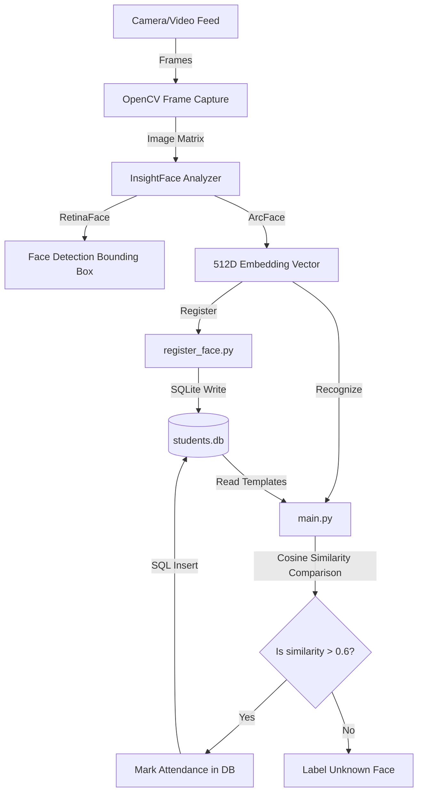
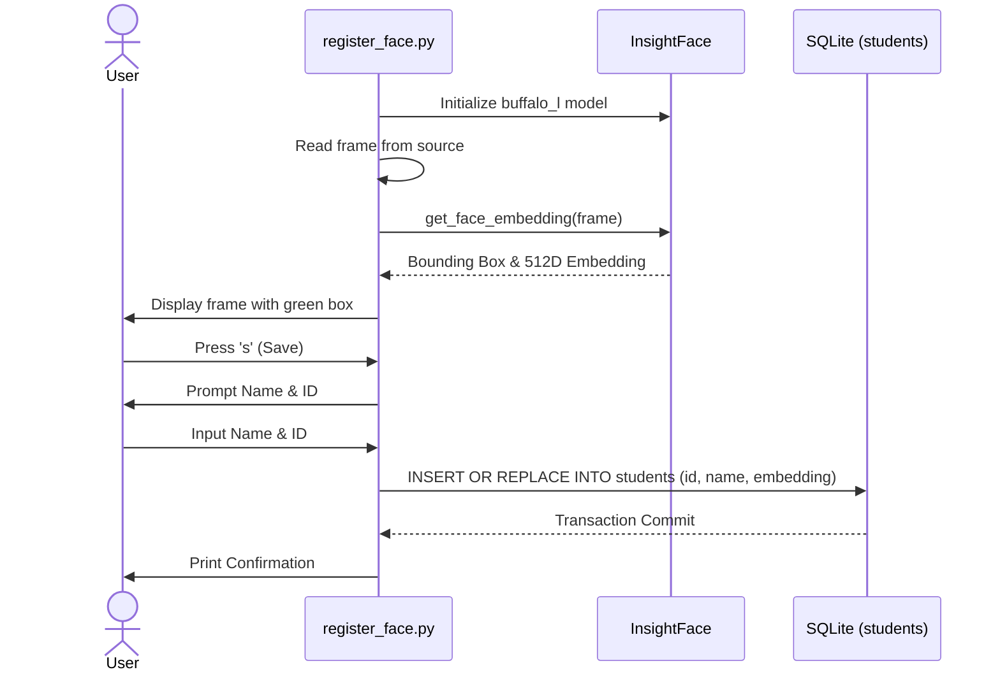
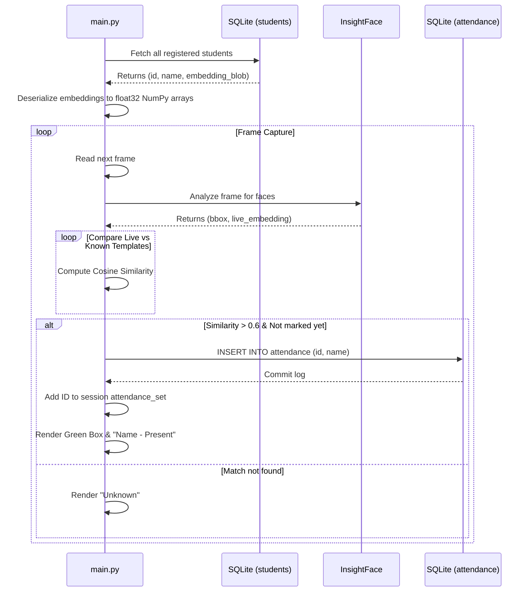

# System Architecture & Flow

This document details the system design, data flow, and interactions between the components of the Face Recognition Attendance System.

---

## 🏗️ High-Level System Overview

The system follows a modular architectural pattern consisting of three core layers:
1. **Perception Layer (OpenCV & Camera/Video Feed)**: Captures frames and handles display windows.
2. **Analysis Layer (InsightFace & ONNX Runtime)**: Detects face boundaries and extracts 512-dimensional numerical embedding vectors representing face features.
3. **Storage & Log Layer (SQLite)**: Stores face representations, student metadata, and appends time-stamped attendance logs.

---

## 🔄 Detailed Process Flow

### 1. Face Registration Process (`register_face.py`)
1. **Camera Initialization**: Reads raw video frames from the configured media source.
2. **Detection**: Passes each frame through `insightface.app.FaceAnalysis`.
3. **Visual Feedback**: Bounding boxes are overlayed on detected faces in real-time.
4. **Registration Trigger**: When the user presses the `s` key:
   - The script prompts the user for the student's Name and ID via terminal standard input.
   - The current frame is processed to retrieve the `512` floating-point face embedding.
   - The ID, Name, and raw embedding bytes (`embedding.tobytes()`) are inserted into the database.
5. **Session Close**: Connection is closed upon pressing `q`.

### 2. Live Face Recognition & Attendance Loop (`main.py`)
1. **Initial Load**: Reads all student registrations from SQLite and converts database blobs back to NumPy arrays (`np.frombuffer`).
2. **Continuous Frame Processing**:
   - Captures frame and resizes it to 1280x720.
   - Submits frame to `FaceAnalysis`.
3. **Similarity Check**:
   - For every detected face embedding, it calculates the Cosine Similarity against all loaded student embeddings.
4. **Verification Threshold**:
   - If the similarity value exceeds `0.6` (60% match confidence), the user is matched.
   - Checks if the user has already been marked present in the current session set `attendance_set`.
   - If not marked, logs the timestamped record in the `attendance` SQL table and prints the confirmation.
5. **Rendering Output**:
   - Draws a green bounding box and writes "[Name] - Present" on the face.
   - Draws a red "Unknown" text overlay if no registered templates match.

