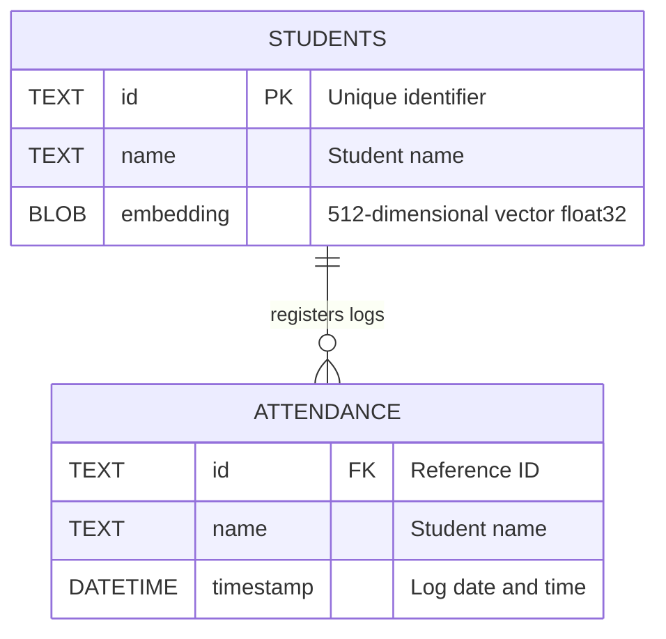

# Database Schema Specification

The application uses **SQLite** for metadata and logs. The database file is located at `face_attendance/database/students.db`. 

SQLite is initialized automatically during start-up if the file or table structures do not exist.

---

## 📊 Database Schema Details

The database contains two tables: `students` (face templates register) and `attendance` (attendance tracking logs).



---

### 1. `students` Table

Stores registered students and their facial embeddings.

| Column | Type | Constraints | Description |
| :--- | :--- | :--- | :--- |
| `id` | `TEXT` | `PRIMARY KEY` | Unique ID of the student. |
| `name` | `TEXT` | `NOT NULL` | Name of the student. |
| `embedding` | `BLOB` | `NOT NULL` | Raw binary representation of the 512-dimensional float32 array. |

#### Storage details for `embedding`:
InsightFace outputs face embeddings as a NumPy array of shape `(512,)` and type `float32`. To store this in the database:
- **Serialization**: Saved as raw binary bytes using `embedding.tobytes()`.
- **Deserialization**: Read back as bytes and reconstituted via:
  ```python
  np.frombuffer(embedding_blob, dtype=np.float32)
  ```

---

### 2. `attendance` Table

Tracks the attendance records as faces are recognized in the live feed.

| Column | Type | Constraints | Description |
| :--- | :--- | :--- | :--- |
| `id` | `TEXT` | None | Student ID corresponding to the recognized student. |
| `name` | `TEXT` | None | Name corresponding to the student. |
| `timestamp` | `DATETIME` | `DEFAULT CURRENT_TIMESTAMP` | The date and time when attendance was marked. |

---

## 🛠️ Handy Management SQL Queries

You can query the database using SQLite clients or from python:

### 1. Check all registered students
```sql
SELECT id, name FROM students;
```

### 2. Check attendance logs
```sql
SELECT datetime(timestamp, 'localtime') AS local_time, id, name 
FROM attendance 
ORDER BY timestamp DESC;
```

### 3. Clear logs or registrations
* **Clear attendance log**:
  ```sql
  DELETE FROM attendance;
  ```
* **Unregister a student**:
  ```sql
  DELETE FROM students WHERE id = 'target_student_id';
  ```
